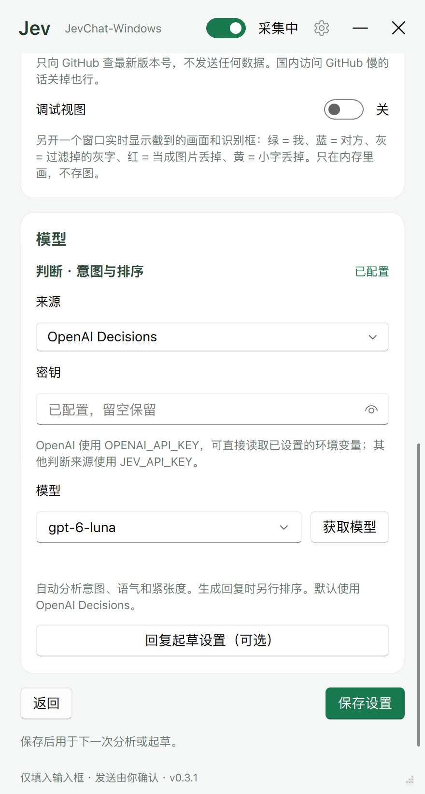
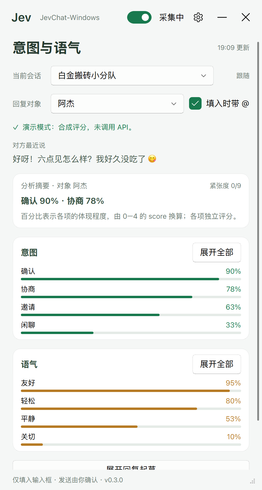
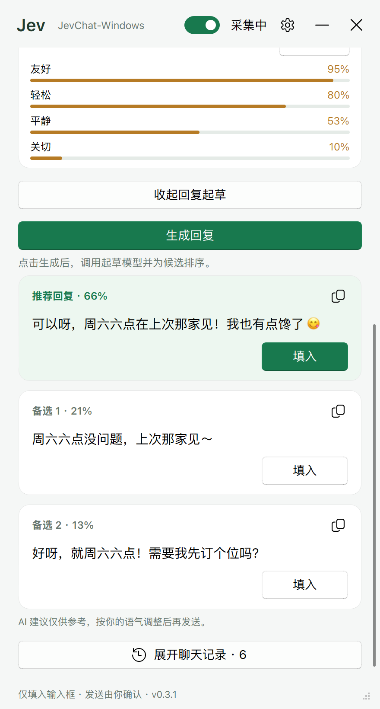

# JevChat Windows · OpenAI Decisions 版

JevChat Windows 是一个运行在 Windows 上的聊天意图分析工具。程序读取聊天窗口中可见的消息，通过本地 OCR 提取文字，再调用判断模型评估对方的意图、语气和对话紧张度。

首页以百分比展示各项意图和语气的体现程度。回复起草默认折叠；需要时展开并点击“生成回复”，即可获取最多三条候选，选择一条填入聊天输入框，检查和修改后自行发送。

本仓库由 [jev-chat/jev-chat-windows](https://github.com/jev-chat/jev-chat-windows) fork 而来，新增了 OpenAI Decisions API 支持，并保留 OpenRouter 和 TypeSafe 判断来源。

## 下载与运行

从 [Releases](https://github.com/Speechlessmanbilibili/jev-chat-windows/releases) 下载 Windows 压缩包，完整解压后运行 `jev-chat-windows.exe`。请保留程序旁的 `_internal` 文件夹。

运行要求：

- Windows 10 1903 或更高版本 / Windows 11，64 位系统。
- 已打开受支持的聊天客户端及聊天窗口。
- 可以访问所选模型服务的网络连接，以及相应的 API 密钥。

发布包已包含 Python 运行环境和所需依赖，普通用户无需另行安装 Python。

## 支持的聊天软件

目前内置微信和 KakaoTalk 的 Windows 桌面客户端适配。

| 软件 | 窗口识别方式 | 本地文字识别 | 己方消息识别 |
| --- | --- | --- | --- |
| 微信 | 识别 `weixin.exe` / `wechat.exe`，优先采集标题为“微信”的主窗口 | RapidOCR，随程序附带中英文模型 | 绿色气泡 |
| KakaoTalk（카카오톡） | 识别 `kakaotalk.exe`，优先采集独立聊天窗口；多个聊天窗口同时打开时选择面积最大的窗口 | Windows OCR，使用系统已安装的语言识别组件 | 黄色气泡 |

微信需要在主窗口中打开目标会话。KakaoTalk 需要打开具体聊天窗口，其联系人列表窗口不适合作为采集对象。两种客户端同时运行时，程序优先选择微信；使用 KakaoTalk 时可先关闭微信。

聊天窗口可以被其他窗口遮挡。请保持窗口打开，并给消息区域留出足够空间；窗口最小化时，程序会将其还原并放到其他窗口下方，以继续采集。

KakaoTalk 的韩语识别需要安装 Windows 韩语 OCR 组件：在系统“设置 → 时间和语言 → 语言和区域”中添加韩语并安装相应语言功能。详细说明见 [韩语识别说明](docs/KOREAN.md) / [한국어 안내](docs/KOREAN.ko.md)。Windows OCR 初始化失败时会回退到中英文 RapidOCR，韩语聊天应先检查系统识别组件是否安装完整。

软件适配规则位于 `app/chatapps.py`，包括进程名、窗口选择、OCR 后端和气泡颜色。新增客户端时，还需检查消息区定位、发言人识别及输入框位置是否适合其布局。

## 配置模型

打开程序的“设置”页，配置判断模型即可开始分析。回复起草设置为可选项，默认折叠。

| 用途 | 默认来源 | 默认模型 | 密钥环境变量 |
| --- | --- | --- | --- |
| 意图判断与候选排序 | OpenAI Decisions | `gpt-6-luna` | `OPENAI_API_KEY` |
| 回复起草 | DeepSeek | `deepseek-flash` | `LLM_API_KEY` |

### OpenAI Decisions

在判断来源中选择“OpenAI Decisions”。程序直接读取 `OPENAI_API_KEY`，包括进程环境变量和 Windows 当前用户的持久环境变量。已经设置该变量时，可将设置页的密钥输入框留空。

也可以在设置页输入密钥并保存；程序会写入 Windows 用户环境变量 `OPENAI_API_KEY`。

PowerShell 中，为当前会话设置密钥：

```powershell
$env:OPENAI_API_KEY = "你的 OpenAI API 密钥"
```

持久保存到当前用户环境：

```powershell
[Environment]::SetEnvironmentVariable("OPENAI_API_KEY", "你的 OpenAI API 密钥", "User")
```

程序向 `https://api.openai.com/v1/decisions` 提交聊天文字和判断题。每次新消息的分析使用一次请求，包含 18 道意图评分题、10 道语气评分题和一道紧张度评分题，类型均为 `score`。生成回复后的候选排序另用 `choice` 题。设置页的“获取模型”会检查 `gpt-6-luna` 的访问权限并提供该模型。接口说明见 [OpenAI Decisions 官方文档](https://developers.openai.com/api/docs/guides/decisions)。

### 回复起草

需要生成回复时，展开“回复起草设置（可选）”并配置起草来源。起草密钥独立使用 `LLM_API_KEY`。在设置页输入密钥并保存，或预先设置该环境变量：

```powershell
$env:LLM_API_KEY = "你的起草服务 API 密钥"
```

起草来源及内置默认配置如下。表中的地址为程序预设值；没有默认模型的来源需要点击“获取模型”选择，或手动填写模型 ID。

| 来源 | 接口协议 | 默认 Base URL | 默认模型 |
| --- | --- | --- | --- |
| DeepSeek | OpenAI 兼容 | `https://api.deepseek.com` | `deepseek-flash` |
| OpenRouter | OpenAI 兼容 | `https://openrouter.ai/api/v1` | `deepseek/deepseek-v4.1-flash` |
| OpenAI | OpenAI 兼容 | `https://api.openai.com/v1` | `gpt-4.1-mini` |
| Moonshot / Kimi | OpenAI 兼容 | `https://api.moonshot.cn/v1` | 手动选择 |
| 智谱 GLM | OpenAI 兼容 | `https://open.bigmodel.cn/api/paas/v4` | 手动选择 |
| 通义千问 | OpenAI 兼容 | `https://dashscope.aliyuncs.com/compatible-mode/v1` | 手动选择 |
| 硅基流动 | OpenAI 兼容 | `https://api.siliconflow.cn/v1` | 手动选择 |
| OpenCode Go | OpenAI 兼容 | `https://opencode.ai/zen/go/v1` | `deepseek-v4.1-flash` |
| Anthropic | Anthropic | `https://api.anthropic.com` | 手动选择 |
| Google Gemini | Gemini | 使用 Google SDK 默认地址 | 手动选择 |
| 自定义 OpenAI 兼容 | OpenAI 兼容 | 自行填写 | 自行填写 |
| 自定义 Anthropic 兼容 | Anthropic | 自行填写 | 自行填写 |

两个自定义来源会显示 Base URL 输入框。OpenCode Go 的模型列表会按当前适配的 Chat Completions 模型过滤。

所有起草来源均读取 `LLM_API_KEY`，包括选择 OpenAI 时。切换起草服务后，请确认密钥、模型和地址属于同一服务。

### 其他判断来源

选择 OpenRouter 或 TypeSafe 时，判断密钥使用 `JEV_API_KEY`。OpenRouter 默认模型为 `typesafe/jev-1.13`；TypeSafe 默认模型为 `jev-latest`。

旧版的 `OPENROUTER_API_KEY` 和 `DEEPSEEK_API_KEY` 仍分别作为 `JEV_API_KEY` 和 `LLM_API_KEY` 的兼容读取来源。已有配置中的服务选择会保留；首次运行默认选择 OpenAI Decisions。



## 意图与语气评分

每个标签独立评估，界面默认展示程度最高的四项，点击“展开全部”可查看全部标签。缺失或拒答的项目显示“—”。

意图包括打招呼、闲聊、分享、询问信息、请求帮助、要求行动、提醒、催促、问责、追问解释、寻求关心、邀请、协商、确认、感谢、道歉、拒绝和结束话题。

语气包括友好、平静、关切、轻松、急切、不满、愤怒、讽刺、冷淡和犹豫。

意图与语气各使用五个有序等级，模型返回等级索引的加权平均分数 `score`，范围为 0–4。意图从“没有相关证据”到“非常明确的核心目的”；语气从“未体现”到“强烈”。显示值为 `score / 4 × 100`，四舍五入为整数。例如，`score = 3.42` 显示为 `86%`。

这些百分比表示体现程度。各项独立，多种意图可以同时获得较高评分，总和无需等于 100%。紧张度单独使用 0–9 的量表。



## 使用流程

1. 打开聊天客户端和需要辅助的会话。
2. 在设置页配置判断模型、关系背景和参考上下文条数，并保存。
3. 开启窗口采集，等待对方的新消息。
4. 查看意图、语气和紧张度。新消息到来后，分析自动更新。
5. 如需回复建议，展开起草区域，点击“生成回复”。展开操作只改变显示状态。
6. 选择候选并点击“填入”，在聊天输入框中检查内容，按需要修改并手动发送。

程序仅分析当前窗口可见、成功识别的上下文。聊天记录切换、文字过小、图片和表情包都可能影响 OCR 结果。可使用设置中的调试视图检查识别区域和文字。

群聊可以启用“指定回复对象”，选择本次要分析和回应的人。起草区域中候选的排序概率表示模型对各选项的相对判断。

指定对象后，首页引用该对象实际参与评分的发言。该人的发言超出参考上下文时，界面会提示增加上下文条数或更换对象。

各会话分别保存本次运行中的上下文和结果。新消息或分析对象变化后，旧候选立即失效；后台返回的过期结果会被丢弃。起草失败的提示显示在起草区域，已完成的意图与语气分析继续保留。

### 界面操作

| 控件 | 用途 |
| --- | --- |
| 当前会话 | 自动跟随聊天窗口中的会话，也可选择已采集的其他会话查看记录和结果。显示“浏览中”时，生成、复制和填入按钮停用；回到实际采集的会话后恢复。 |
| 回复对象 | 启用群聊指定对象后显示。切换对象会重新分析该人的发言，回复候选仍需点击“生成回复”获取。 |
| 填入时带 @ | 在群聊回复前加上普通文本 `@名字 `。需要客户端的正式提及提醒时，请在客户端中选择对应成员。 |
| 采集开关 | 位于标题栏。暂停后停止窗口采集，当前会话已有的有效候选仍可复制或填入。 |
| 填入 / 复制 | 将候选放入聊天输入框或剪贴板。填入后由用户检查、修改并发送。 |
| 聊天记录 | 展开本次运行中识别到的消息和状态信息，可用于核对 OCR 结果及查看错误详情。 |

辅助窗口保持置顶，可拖动标题栏和调整大小；窄窗口会使用紧凑布局。最小化按钮将其收到任务栏，关闭窗口则退出程序。



## 设置说明

通常修改设置后点击“保存设置”，后续分析或起草便使用新配置。界面语言和调试视图开关立即生效。

| 设置 | 作用与默认值 |
| --- | --- |
| 界面语言 | 支持简体中文 / 한국어，选择后立即刷新并自动保存。启动时 `JEVCHAT_LANG=zh` / `ko` 优先于保存的语言设置。 |
| 你们的关系 | 恋人、朋友、同事、家人或自定义关系；判断和起草均参考该背景，默认恋人。 |
| 参考上下文 | 最近 3–30 条已识别消息，默认 10 条；判断和起草均使用该条数。 |
| 说话风格 | 可选的自由文本，仅供起草模型参考；留空时参考本人此前的短消息。 |
| 群聊指定回复对象 | 默认关闭；开启后可在已识别到发言人的会话中选择分析和回复对象。 |
| 判断来源 / 密钥 / 模型 | 配置意图分析与候选排序。密钥已设置时，输入框留空会保留已有值。 |
| 回复起草设置（可选） | 默认折叠。配置起草来源、独立密钥和模型；自定义来源还需填写 Base URL。 |
| 起草时开启思考模式 | 默认关闭；由 DeepSeek、OpenRouter、Anthropic 和 Gemini 的适配层处理，实际效果取决于所选模型。 |
| 启动时检查更新 | 默认开启；启动时查询一次本 fork 的最新 Release，有新版本时显示下载入口。 |
| 调试视图 | 默认关闭；开启独立窗口，显示采集画面、消息区、会话标题区域、识别框和 OCR 耗时。关闭调试窗口会同时关闭该开关。 |

关系、模型、语言等普通设置保存在 `config.json`。密钥保存在 Windows 当前用户环境变量中。当前会话、当前回复对象和“填入时带 @”的选择仅保存在本次运行的内存中。

## 工作原理与 API 用量

程序通过 Windows Graphics Capture 获取聊天窗口画面，在本地定位消息区域、识别会话标题和文字，再根据气泡颜色区分己方与对方消息。各会话分别进行消息去重和上下文整理，识别到对方的新消息后调用判断服务。

正常调用流程如下：

1. 自动分析：向判断服务提交一次请求，获取意图、语气和紧张度评分。
2. 按需起草：点击“生成回复”后，向起草服务请求候选；候选不足时，程序会再请求一次补充。
3. 候选排序：得到两条或三条候选时，向判断服务提交一次 `choice` 请求；仅有一条候选时直接展示。

切换群聊分析对象也会触发判断请求。“获取模型”和实际 API 测试会访问对应服务。费用由所选服务和模型的计费规则决定。

## 数据处理

- 正常采集和调试视图中的窗口图像在内存中处理，本地 OCR 提取文字，截图不写入磁盘。开发用合成数据预览可通过 `--screenshot` 显式保存示例图片。
- 自动分析时，最近的上下文、关系背景和群聊回复对象会发送至所选判断服务；上下文包含消息正文及识别到的发言人名。候选排序还会提交候选文本。
- 点击“生成回复”后，起草服务会收到相关上下文、关系背景、指定对象、评分参考和填写的说话风格。程序还会从本次会话记录中选取最多 12 条本人短消息作为风格样本，每条不超过 60 个字符。
- 密钥保存在进程环境变量 / Windows 用户环境中，普通设置保存在程序目录下的 `config.json`。
- 聊天内容保存在本次运行的内存中，关闭程序后清除。
- 程序只执行填入操作，发送由用户完成。
- 启动时默认检查本 fork 的 GitHub Release；可在设置中关闭。

使用前请确认你有权读取相关聊天内容，并按自己的需求选择模型服务。

## 常见问题与识别限制

| 现象 | 检查方法 |
| --- | --- |
| 找不到聊天窗口 | 确认受支持的客户端和具体会话已打开；使用 KakaoTalk 时检查独立聊天窗口及微信的优先选择规则。 |
| 消息区识别失败 / 漏字 | 放大聊天窗口，缩小过高的输入区域，并检查文字大小。消息区定位依赖窗口布局和分隔线，客户端改版或自定义外观可能需要调整适配。 |
| 韩语文字识别异常 | 检查 Windows 韩语 OCR 组件；操作步骤见韩语识别说明。 |
| 群聊发言人不正确 | 展开聊天记录并查看调试视图；名字行漏识别时，消息可能归到上一位发言人名下。 |
| 会话名或重复消息异常 | 会话标题和消息按文字相似度归并，名称相近的会话可能被合并，连续相同的消息可能被去重。 |
| 模型请求失败 | 核对来源、模型、密钥、网络连接及服务账户状态；具体错误信息可在聊天记录中查看。 |
| 候选填入失败 | 检查聊天输入框布局，或使用复制按钮手动粘贴。填入功能依赖消息区域下方的输入框位置。 |

调试视图中的框线含义：绿色为己方消息，蓝色为对方消息，橙色为发言人名，灰色为过滤的灰字，红色为按图片过滤的文字，黄色为过滤的小字。图片、表情包和语音内容需要用户在聊天客户端中查看。

## 从源码运行

使用 Python 3.11 或 3.12。RapidOCR 1.4 系列依赖 Python 3.13 以下版本。

```powershell
git clone https://github.com/Speechlessmanbilibili/jev-chat-windows.git
cd jev-chat-windows
python -X utf8 -m venv .venv
.\.venv\Scripts\python.exe -X utf8 -m pip install -r requirements.txt
.\.venv\Scripts\python.exe -X utf8 main.py
```

在已有项目目录中开发时，从创建虚拟环境的步骤开始即可。

运行测试：

```powershell
.\.venv\Scripts\python.exe -X utf8 -m unittest discover -s tests -v
```

使用合成聊天数据预览界面：

```powershell
.\.venv\Scripts\python.exe -X utf8 -m tools.preview_ui --state settings
```

发布包也支持合成数据预览，无需配置密钥：

```powershell
.\jev-chat-windows.exe --preview-ui --state ready
```

使用合成对话进行实际 API 测试，需要配置判断密钥，会产生 API 用量：

```powershell
.\.venv\Scripts\python.exe -X utf8 -m tools.demo --cases
```

添加 `--draft` 可额外验证回复起草和排序，此时还需配置起草密钥。

## 打包

在 Windows 中安装依赖后执行：

```powershell
.\.venv\Scripts\python.exe -X utf8 -m pip install pyinstaller
.\.venv\Scripts\python.exe -X utf8 -m PyInstaller --noconfirm --clean jev.spec
```

构建结果位于 `dist/jev-chat-windows/`。分发时应包含整个目录，以及 `LICENSE`、`NOTICE` 和本 README。仓库中的 GitHub Actions 工作流也提供 Windows 构建。

本机生成完整发布包可使用 `tools/build_release.ps1`。脚本先运行测试，再编译并打包，结果保存在 `dist/local-v版本号-时间/` 中：

```powershell
.\tools\build_release.ps1
```

## 项目结构

| 目录 / 文件 | 用途 |
| --- | --- |
| `app/` | 窗口采集、OCR、界面、填入、设置与更新检查 |
| `app/chatapps.py` | 微信 / KakaoTalk 的窗口、OCR 和气泡识别规则 |
| `core/providers.py` / `core/llm.py` | 模型来源预设和 OpenAI / Anthropic / Gemini 接口适配 |
| `core/openai_decisions.py` | OpenAI Decisions 请求与响应转换 |
| `core/jev_client.py` | 判断来源路由及错误处理 |
| `core/intent.py` | 意图与语气标签、评分标准、百分比换算 |
| `core/questions.py` | 上下文整理和回复排序题 |
| `core/draft.py` / `core/llm.py` | 候选回复生成和模型接口适配 |
| `core/engine.py` | 判断、起草和排序的调用流程 |
| `tests/` | 接口契约、密钥隔离和引擎集成测试 |
| `tools/` | 合成数据预览、API 测试及本地发布包构建 |
| `probe/` | 上游保留的窗口采集、OCR 和模型实验脚本 |
| `docs/` | 界面示例、韩语识别说明和 Release 说明 |

## 许可证与致谢

本项目自身代码采用 MIT 许可证，详见 [LICENSE](LICENSE)。分发时请保留 `LICENSE` 和 `NOTICE`，并在说明中注明上游来源。原项目及相关组件的版权说明见 [NOTICE](NOTICE)。

发布包包含的依赖各自适用其许可证。界面组件 [PySide6-Fluent-Widgets](https://github.com/zhiyiYo/PyQt-Fluent-Widgets/tree/PySide6#license) 提供 GPLv3 / 商业双重许可，其作者为商业用途提供[商业授权](https://qfluentwidgets.com/price)。其他主要依赖的许可包括 PySide6 的 LGPL-3.0、RapidOCR 的 Apache-2.0，以及 windows-capture 的 MIT；详细清单见 `NOTICE` 和各组件的许可证文本。

感谢以下项目的作者与贡献者：

- [jev-chat/jev-chat-windows](https://github.com/jev-chat/jev-chat-windows)：本 fork 的 Windows 上游。
- [Finderchangchang/jev-chat-JARVIS](https://github.com/Finderchangchang/jev-chat-JARVIS)：Android 原版及早期 Jev 判断设计。
- [RapidOCR](https://github.com/RapidAI/RapidOCR)、ONNX Runtime：本地文字识别。
- [windows-capture](https://github.com/NiiightmareXD/windows-capture)：Windows Graphics Capture 的 Python 绑定。
- PySide6 和 [PyQt-Fluent-Widgets](https://github.com/zhiyiYo/PyQt-Fluent-Widgets)：桌面界面及组件。

本 fork 的版本变更说明见 [Releases](https://github.com/Speechlessmanbilibili/jev-chat-windows/releases)，已保存的发布说明位于 `docs/releases/`。
